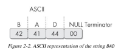
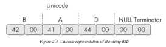
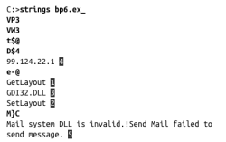

# File strings

## Strings

* Any sequence of printable characters is a **string**
* We can use strings to get hints about the functionality of a program.
  * Accesses a URL
  * Opens another program

### Technical Details

* Strings are terminated by a null byte \(0x00\)
* [ASCII](http://www.asciitable.com) characters are 8 bits long
  * Now called ANSI

* Unicode characters are 16 bits long
  * Microsoft calls them "wide characters"

### The strings command

* Native in Linux, also available for Windows
* Ignores context and formatting
  * can analyze any file type and detect strings across an entire file
    * Can result in false positive \(instructions, addresses, etc.\)
* Finds all strings in a file 3 or more characters long

#### For Windows

* Bold items can be ignored
* GetLayout and SetLayout are Windows functions
* GDI32.DLL is a Dynamic Link Library

### Can we always rely on strings?

* Legitimate programs usually include many strings.
* Malware that is packed or obfuscated contains very few strings.
* If upon searching a program with Strings, you find that it has only a few strings, it is probably either obfuscated or packed, suggesting that it may be malicious.
* You’ll likely need to throw more than static analysis at it in order to investigate further

