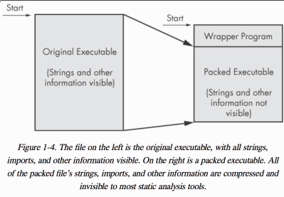
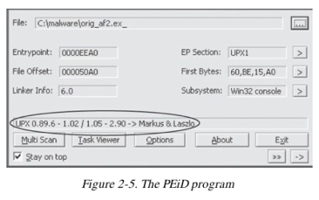

# Packed and Obfuscated Malware

### Obfuscated and Packed Malware

* Obfuscated programs are ones whose execution the malware author has attempted to hide.
* Packed programs are a subset of obfuscated programs in which the malicious program is compressed and cannot be analyzed.

### Packing Files

* The code is compressed, like in Zip file
* This makes the strings and instructions unreadable
* All you'll see is the wrapper – small code that unpacks the file when it is run

