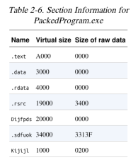
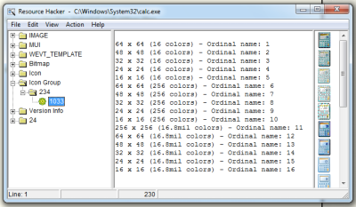

# PE File Headers and Sections

### Important PE Sections

* **.text** -- instructions for the CPU to execute
* **.rdata** -- imports & exports
* **.data** – global data
* **.rsrc** – strings, icons, images, menus

### Time Date Stamp

* Shows when this executable was compiled
* Older programs are more likely to be known to antivirus software
* But sometimes the date is wrong
  * All Delphi programs show June 19, 1992
  * Date can also be faked

### IMAGE\_SECTION\_HEADER

* Virtual Size – RAM
* Size of Raw Data – DISK
* For **.text** section, normally equal, or nearly equal
* Packed executables show Virtual Size much larger than Size of Raw Data for **.text** section

### Resource Hacker

* Lets you browse the **.rsrc** section
* Strings, icons, and menus

