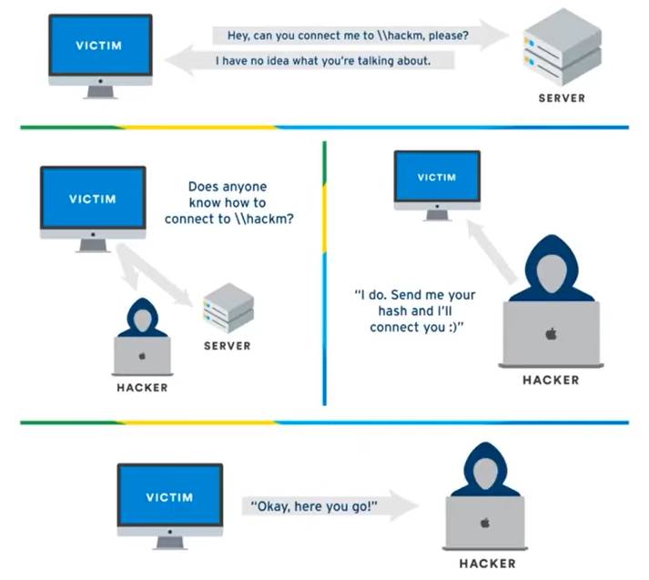
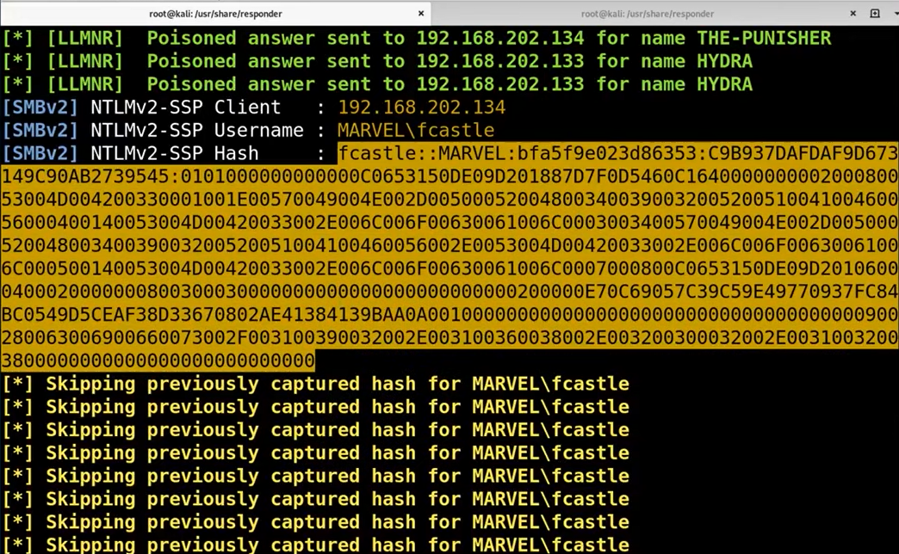

# Week 8: LLMNR/NBT-NS Poisoning

**Hello Enumeration, My Old Friend** - This lesson will cover post-exploitation enumeration. In other words, we’ve gained access to a single machine in a network, now what are we looking for? The chapter will focus heavily on Active Directory enumeration concepts as that is the likely environment a pentester will encounter in the real world. However, lessons will be provided for non-Active Directory environments as well. Important tools that will be discussed are nbtscan, nslookup, nbtstat, net commands, and more.

**Active Directory Exploitation** - This lesson focuses on the recognition of vulnerabilities and exploitation tactics in an internal Active Directory environment. Attacks that will be introduced include: LLMNR poisoning/hash cracking, SMB hash relaying, pass the hash, token impersonation, kerberoasting, GPP/c-password attacks, and PowerShell attacks. More attacks will likely be added as the lesson is written, but the most common have been provided.

## Notes

* LLMNR/NBT-NS used to identify a host when DNS fails.
* Name resolution as a way to connect to a share \(e.g. SMB\)
* Hashes are typically going out to a known share or device.
  * Sometimes don't know where to go and will send a broadcast message. Man in the Middle can say send me your hash and I can connect you.



* Crack the hash then navigate around the network and see what sticks.
* Or, relay the hash without ever knowing the password, **NTLM relay**

## LLMNR/NBT-NS Poisoning

* Sitting on the network with no privileges, turn on Responder before running scans. \(Internal Technique, not on OSCP\)
  * Scans \(nmap, nessus, etc\) generates traffic. The more traffic on the network, the better it is for an attacker. Maybe something screws up and sends a hash your way.
  * Best time to run Responder is beginning of the day or after lunch. You can leave it on all day.
* Responder.py: `/usr/share/responder` on Kali

```text
python Responder.py -I eth0 -rdw
```



* if you find Default credentials anywhere with configuration abilities \(e.g. a Printer\), there can be a test SMB share button. If you send it to yourself, you can get credentials. SMB sometimes doesn't follow least-privileged and you can get an instant win.

```text
# Linux --VMs will take much longer
hashcat -m 5600 hash.txt /root/rockyou.txt #NetNTLMv2

# Windows
..\hashcat-4.2.1>hashcat64.exe -m 5600 hash.txt rockyou.txt
```

