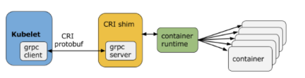

# Chapter 4: Kubernetes Architecture

**Introduction**

In this chapter, we will explore the Kubernetes architecture, the different components of the master and worker nodes, the cluster state management with etcd and the network setup requirements. We will also talk about the network specification called Container Network Interface (CNI), which is used by Kubernetes.

**Discuss the Kubernetes architecture.**

* One or more master nodes
  * master node provides a running environment for the control plane responsible for managing the state of a Kubernetes cluster
  * To ensure the control plane's fault tolerance, master node replicas are added to the cluster, configured in High-Availability (HA) mode. While only one of the master node replicas actively manages the cluster, the control plane components stay in sync across the master node replicas
* One or more worker nodes
* Distributed key-value store, such as etcd.
  * To persist the Kubernetes cluster's state, all cluster configuration data is saved to etcd
  * etcd is configured on the master node ([stacked](https://kubernetes.io/docs/setup/independent/ha-topology/#stacked-etcd-topology)) or on its dedicated host ([external](https://kubernetes.io/docs/setup/independent/ha-topology/#external-etcd-topology)) to reduce the chances of data store loss by decoupling it from the control plane agents.

**Explain the different components for master and worker nodes**.

* master node
  * API server
    * All the administrative tasks are coordinated by the kube-apiserver, a central control plane component running on the master node
  * Scheduler
    * the kube-scheduler assigns new objects, such as pods, to nodes. decisions are made based on current Kubernetes cluster state and new object's requirements. The scheduler obtains from etcd, via the API server, resource usage data for each worker node in the cluster. The scheduler also receives from the API server the new object's requirements which are part of its configuration data. Requirements may include constraints that users and operators set, such as scheduling work on a node labeled with disk==ssd key/value pair. The scheduler also takes into account Quality of Service (QoS) requirements, data locality, affinity, anti-affinity, taints, toleration, etc.
  * Controller managers
    * controller managers are control plane components on the master node running controllers to regulate the state of the Kubernetes cluster. Controllers are watch-loops continuously running and comparing the cluster's desired state (provided by objects' configuration data) with its current state (obtained from etcd data store via the API server).
    * The kube-controller-manager runs controllers responsible to act when nodes become unavailable, to ensure pod counts are as expected, to create endpoints, service accounts, and API access tokens.
    * The cloud-controller-manager runs controllers responsible to interact with the underlying infrastructure of a cloud provider when nodes become unavailable, to manage storage volumes when provided by a cloud service, and to manage load balancing and routing.
  * etcd.
    * etcd is a distributed key-value data store used to persist a Kubernetes cluster's state. New data is written to the data store only by appending to it, data is never replaced in the data store. Obsolete data is compacted periodically to minimize the size of the data store.
* worker node: provides a running environment for client applications. Though containerized microservices, these applications are encapsulated in Pods, controlled by the cluster control plane agents running on the master node. Pods are scheduled on worker nodes, where they find required compute, memory and storage resources to run, and networking to talk to each other and the outside world.
  * Container runtime
    * Kubernetes requires a container runtime on the node where a Pod and its containers are to be scheduled. Kubernetes supports many container runtimes such as: Docker, CRI-O, containerd, rkt, rktlet
  * kubelet
    * kubelet is an agent running on each node and communicates with the control plane components from the master node
    * The kubelet connects to the container runtime using [Container Runtime Interface](https://github.com/kubernetes/community/blob/master/contributors/devel/sig-node/container-runtime-interface.md) (CRI). CRI consists of protocol buffers, gRPC API, and libraries.
  * kube-proxy: the network agent which runs on each node responsible for dynamic updates and maintenance of all networking rules on the node. It abstracts the details of Pods networking and forwards connection requests to Pods.
  * Addons for DNS, Dashboard, cluster-level monitoring and logging.

**Review the Kubernetes network setup requirements.**

Decoupled microservices based applications rely heavily on networking in order to mimic the tight-coupling once available in the monolithic era. Networking, in general, is not the easiest to understand and implement. Kubernetes is no exception - as a containerized microservices orchestrator is needs to address 4 distinct networking challenges:

* Container-to-container communication inside Pods
* Pod-to-Pod communication on the same node and across cluster nodes
* Pod-to-Service communication within the same namespace and across cluster namespaces
* External-to-Service communication for clients to access applications in a cluster.

**Pod-to-External World Communication**

For a successfully deployed containerized applications running in Pods inside a Kubernetes cluster, it requires accessibility from the outside world. Kubernetes enables external accessibility through services, complex constructs which encapsulate networking rules definitions on cluster nodes. By exposing services to the external world with kube-proxy, applications become accessible from outside the cluster over a virtual IP.\
