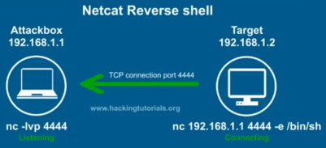
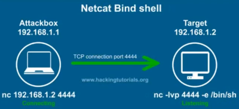

# Week 7: Exploitation, Shells, and Some Credential Stuffing

**Gaining a Shell with Metasploit** - This lesson will cover how to use Metasploit to gain shell access to a vulnerable machine. This builds upon the introductory Metasploit from section 8 as we move from the auxiliary/scanning portion of Metasploit to the exploit portion. This lesson is important as Metasploit is a common tool in nearly every penetration testers toolkit, especially at the beginner level.  
**Compiling Exploits** - This lesson will add to exploitation learned in section 9, except that the exploitation is now done manually, without Metasploit. This will teach the reader how to safely download exploits from the web, generate shellcode, compile the exploit if necessary, and execute it against a vulnerable machine.  
**When Nothing Else Works** - The previous two lessons in focus on having an exploit readily available that will provide shell access. As a penetration tester, gaining shell from an exploit does not happen most of the time. Sometimes, we have to get creative. This may include using social engineering and password spraying Outlook/other web applications. The section also focuses on the failing mentality and how it is okay to not break in on every external. Lastly, it will cover some common non-critical findings/things to look for that can be added to a report, such as default web pages, public RDP, public SNMP, etc.

## Notes

| Non-staged Payload | Staged Payload |
| :--- | :--- |
| sends exploit shellcode all at once | sends payload in stages |
| larger in size and don't always work | can be less stable |
| Ex: windows/meterpreter\_reverse\_tcp | Ex: windows/meterpreter/reverse\_tcp |

